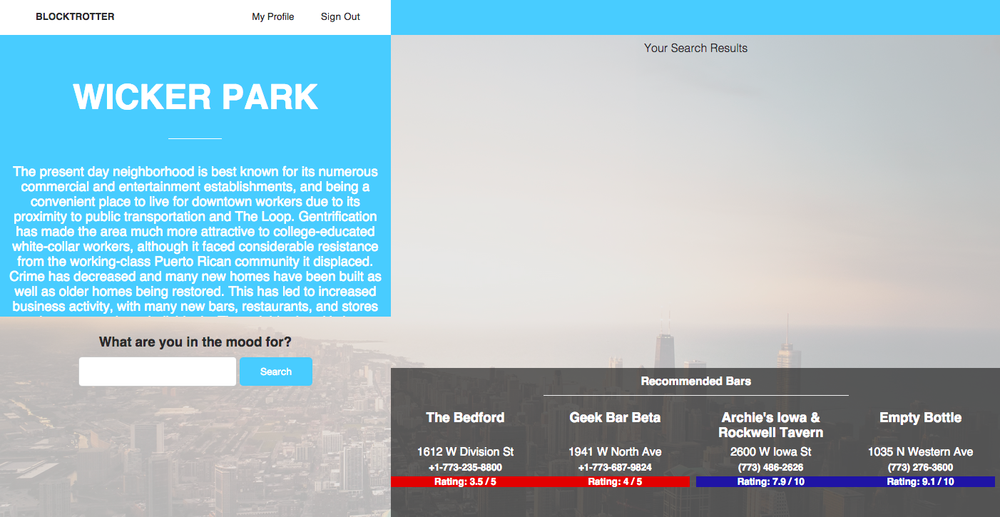
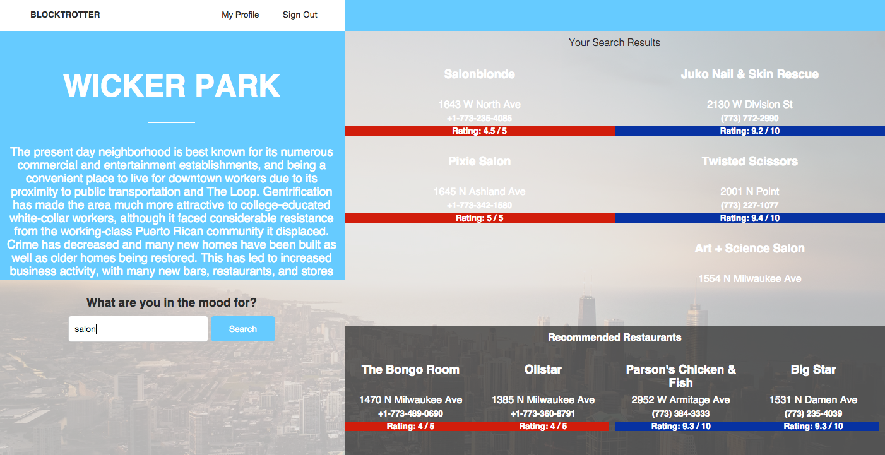

# BlockTrotter - A guide to Chicago neighborhoods

##Synopsis
Blocktrotter is a application (using Rails and Javascript) that helps visitors and residents better explore some of the dozens of neighborhoods in the city of Chicago. With Yelp and Foursquare recommendations, Blocktrotter gives users the best options for their trip.

##Using Multiple APIs
Blocktrotter pulls data from the [Foursquare](https://developer.foursquare.com/) & [Yelp](https://www.yelp.com/developers/documentation) (actually using the [Yelp Gem](https://github.com/Yelp/yelp-ruby)) APIs, as well as a database of Chicago neighborhoods to provide users with restaurant and bar suggestions within a selected area.

Our homepage allows site visitors to use the app without signing in. However, users can sign up and sign in from the homepage. The act of signing up also immediately signs in a user.

##Nieghborhoods
Selecting a neighborhood brings users to a Neighborhoods page, which provides them with a rotation of 4 restaurants (2 from Yelp, 2 from foursquare) and 4 bars (2 from Yelp, 2 from foursquare)

User Stories

Jake
USER ACCOUNTS
User can sign up for a new account.
User can log into their account.

NEIGHBORHOOD SEARCH
User can search for a neighborhood in Chicago.
User can select a neighborhood from a list of neighborhoods (for those who are unfamiliar with the neighborhoods).

NEIGHBORHOOD PAGE
User can read general information about the neighborhood.
Top restaurants, club, bars, etc.
Events going on?
User can search for specific places within each neighborhood.
User can select a place to see more details.
Location
Reviews
User can access location on google maps.

James
Authentication
User can sign in/sign out, log-in/log-out
Admin can sign in/sign out, log-in/log-out

Index Page
User can select Chicago neighborhood
User can read brief information about neighborhood (walkability, history, etc.)
User can select (maybe search?) for thing they want to do and get results
User can view Yelp and Foursquare ratings of those results

Edit
Admin

New
Admin can add new location that is not yet on yelp/foursquare

Show Page
User can select one of those results for more information
User can see where results are on neighborhood map
User can view closest public transportation locations

Destroy
Admin can delete … stuff? Maybe this shouldn’t exst.

Update
Logged-in user can leave their own review/score

User Stories - Julia C

The user can sign up.
The user can log in.
The user can log out.
The user can search by neighborhood or zip code in the city of Chicago.
The user can toggle by time of day to zone in on types of services available.
The user can search by term for activities of interest.

Home Wireframe

