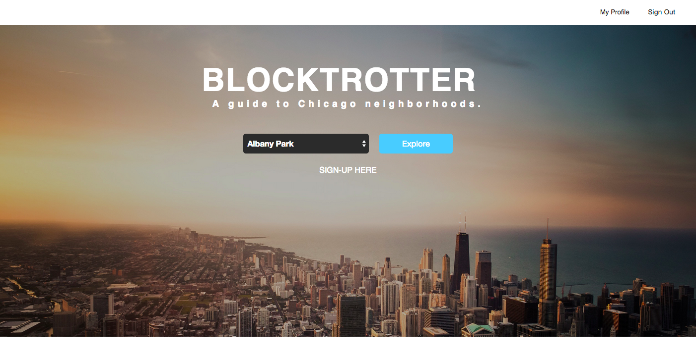
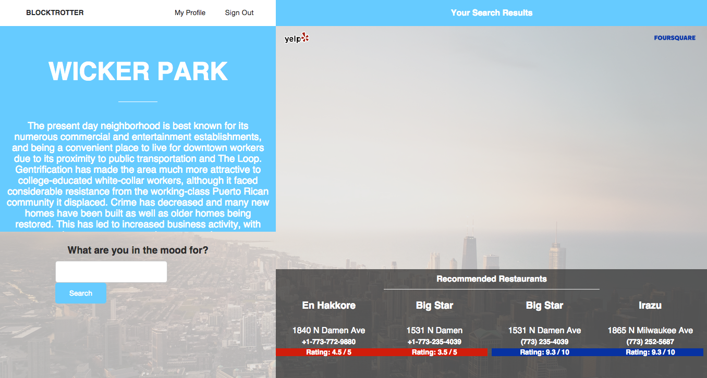
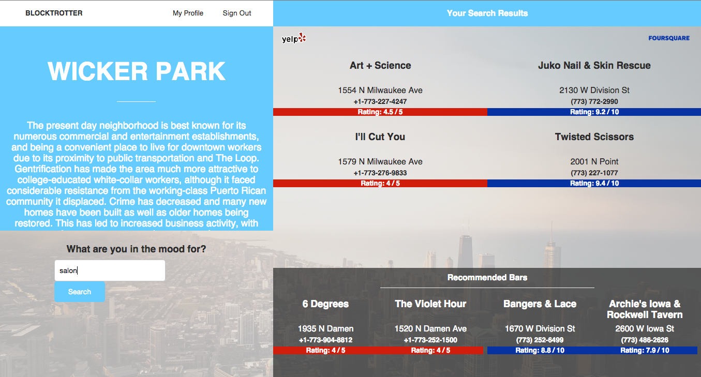
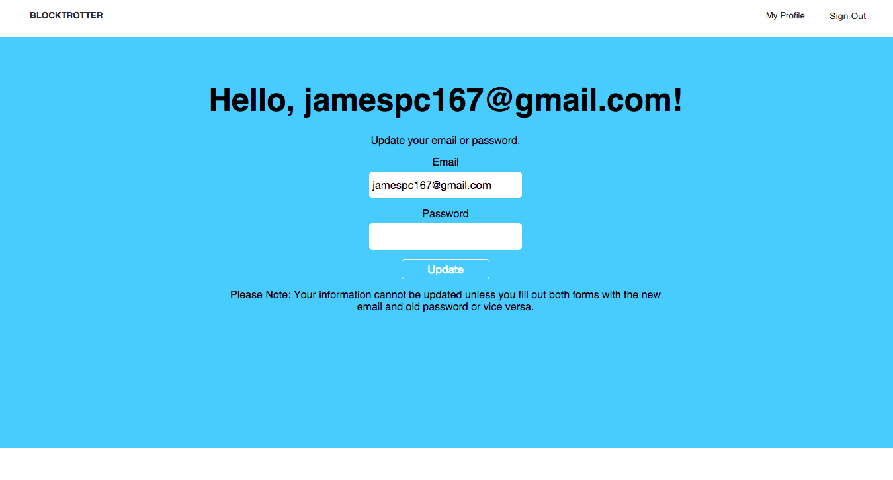
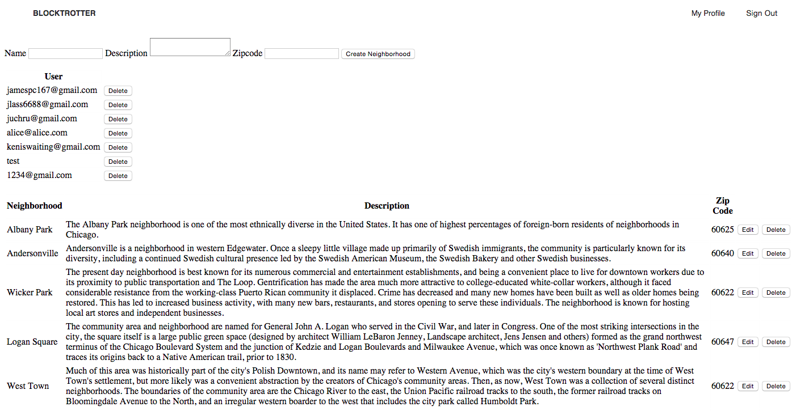

# BlockTrotter - A guide to Chicago neighborhoods

:bowtie: :100: :zap: :beers: :sunglasses: :cocktail: :pizza: :hamburger: :thumbsup: :trollface: :satisfied:

##Synopsis
Blocktrotter is a application (using Rails and Javascript) that helps visitors and residents better explore some of the dozens of neighborhoods in the city of Chicago. With Yelp and Foursquare recommendations, Blocktrotter gives users the best options for their trip.

##Using Multiple APIs
Blocktrotter pulls data from the [Foursquare](https://developer.foursquare.com/) & [Yelp](https://www.yelp.com/developers/documentation) (actually using the [Yelp Gem](https://github.com/Yelp/yelp-ruby)) APIs, as well as a database of Chicago neighborhoods to provide users with restaurant and bar suggestions within a selected area.

Our homepage allows site visitors to use the app without signing in. However, users can sign up and sign in from the homepage. The act of signing up also immediately signs in a user.

`root 'neighborhoods#index'`

##Neighborhoods
Selecting a neighborhood brings users to a Neighborhoods page, which provides them with a rotation of 4 restaurants (2 from Yelp on the left, 2 from foursquare on the right) and 4 bars (2 from Yelp, 2 from foursquare) in the lower right corner of the page. Appropriate Yelp and foursquare logos are included in the left and right side of the page, respectively, to differentiate results from those APIs.

Using our search bar provides the user with additional options, which appear in the upper right side. We remain consistent with Yelp data on the left, foursquare data on the right.

Clicking on any of the results links the user to the corresponding Yelp or foursquare page.

##Users

Currently our Users page allows a user to edit his or her email address and password.

In future iterations of this site we look forward to allowing users to "favorite" certain businesses and potentially leave reviews of their own.

##Admin

Currently Admin users are created using a task in our `make_neighborhoods.rake`  file. Our authentication process allows users with Admin access to proceed to our `/admin` page. Here an Admin can create, update and destroy the `name` `description` and `zip code` of any neighborhood in Chicago. Admins can also destroy a user.

##Tests
