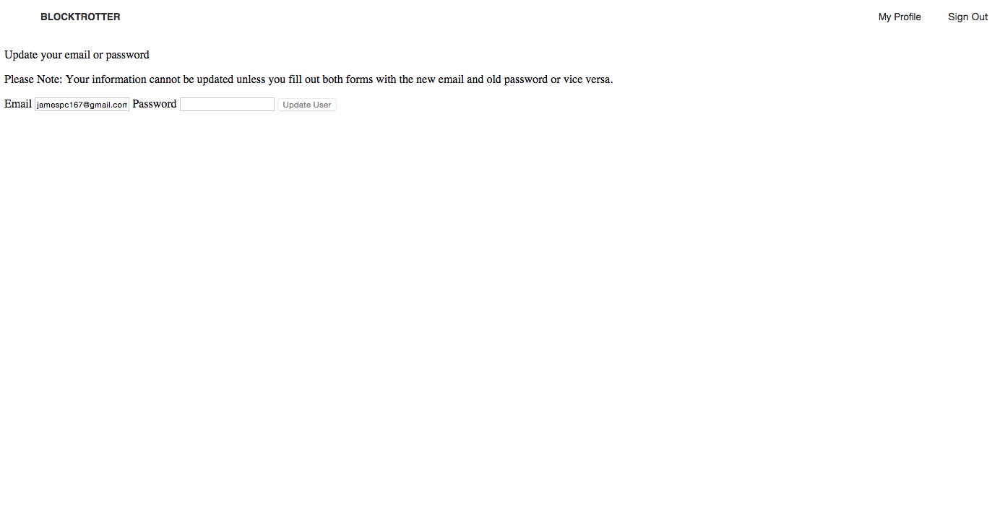

# BlockTrotter - A guide to Chicago neighborhoods

##Synopsis
Blocktrotter is a application (using Rails and Javascript) that helps visitors and residents better explore some of the dozens of neighborhoods in the city of Chicago. With Yelp and Foursquare recommendations, Blocktrotter gives users the best options for their trip.

##Using Multiple APIs
Blocktrotter pulls data from the [Foursquare](https://developer.foursquare.com/) & [Yelp](https://www.yelp.com/developers/documentation) (actually using the [Yelp Gem](https://github.com/Yelp/yelp-ruby)) APIs, as well as a database of Chicago neighborhoods to provide users with restaurant and bar suggestions within a selected area.

Our homepage allows site visitors to use the app without signing in. However, users can sign up and sign in from the homepage. The act of signing up also immediately signs in a user.

`root 'neighborhoods#index'`

##Neighborhoods
Selecting a neighborhood brings users to a Neighborhoods page, which provides them with a rotation of 4 restaurants (2 from Yelp on the left, 2 from foursquare on the right) and 4 bars (2 from Yelp, 2 from foursquare) in the lower right corner of the page.

Using our search bar provides the user with additional options, which appear in the upper right side. We remain consistent with Yelp data on the left, foursquare data on the right.

Clicking on any of the results links the user to the corresponding Yelp or foursquare page.

##Users

##Admin

##Tests
